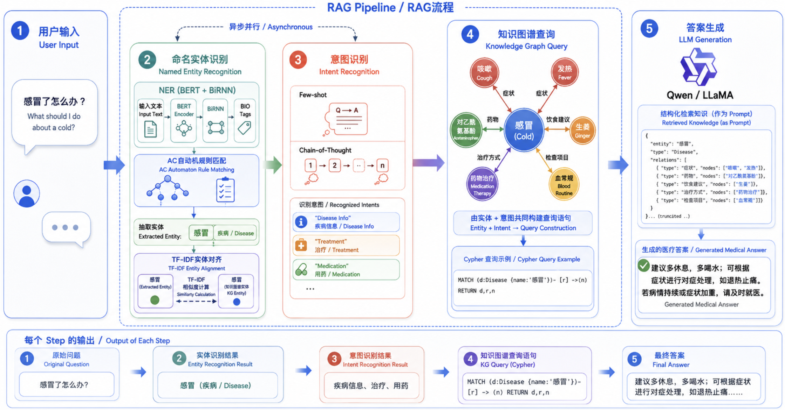
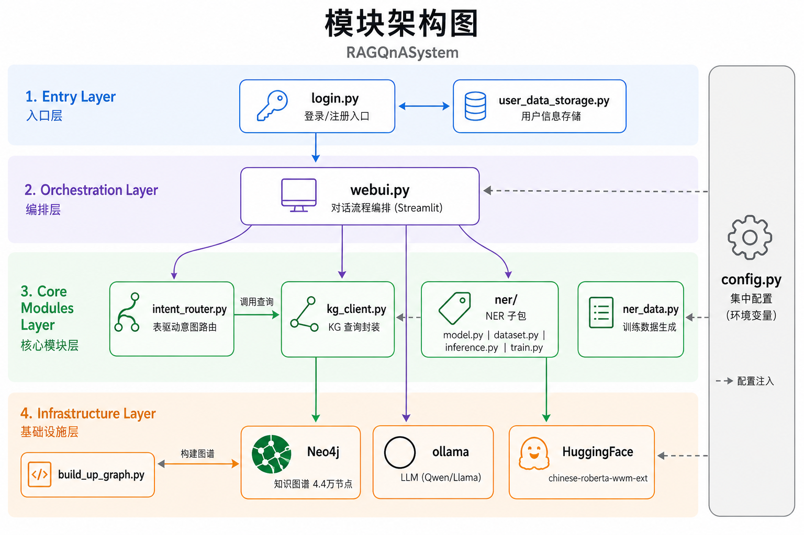
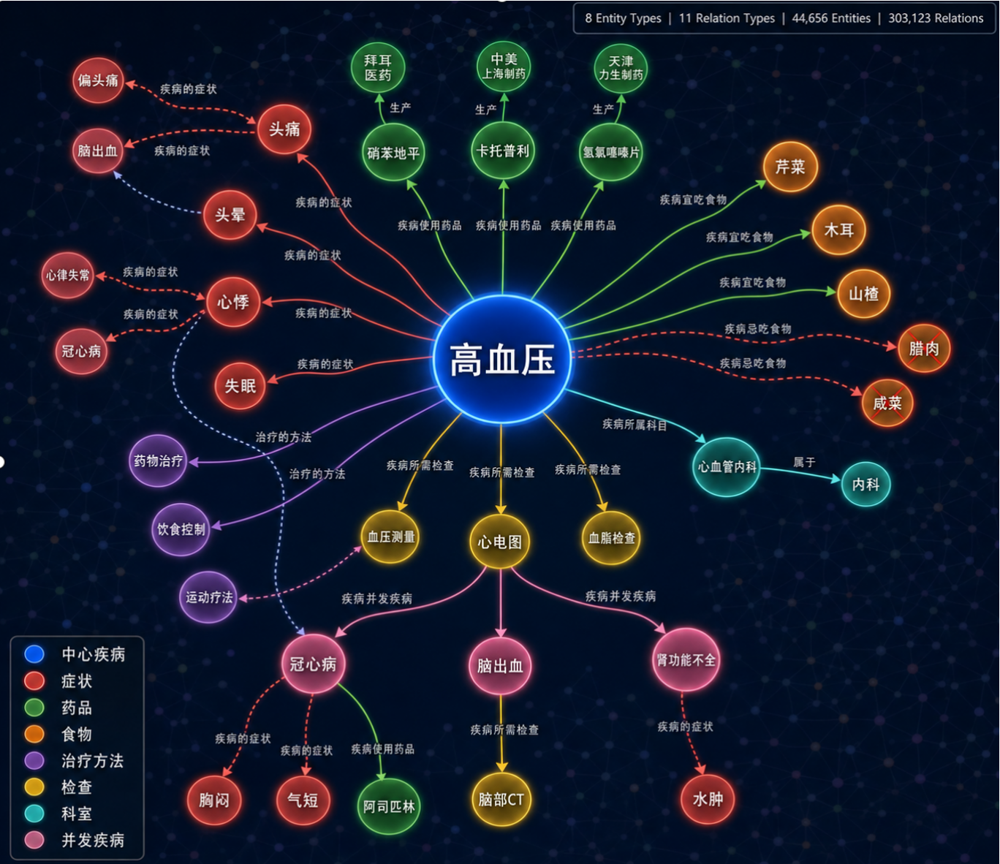
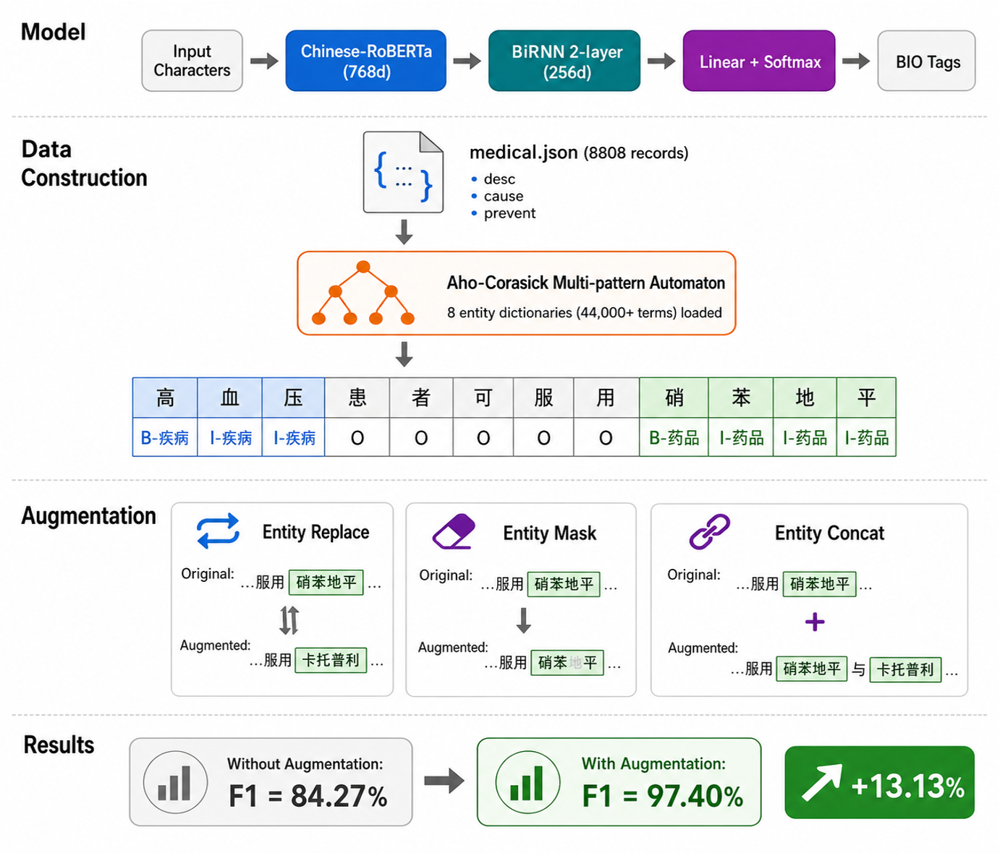
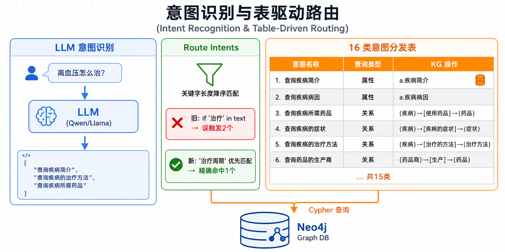

<div align="center">

# 🏥 RAGQnASystem

### 基于知识图谱 RAG 与大模型的医疗智能问答系统

<br>

[](https://www.python.org/)
[](https://pytorch.org/)
[](https://streamlit.io/)
[](https://neo4j.com/)
[](https://ollama.com/)
[](LICENSE)

<br>

**知识图谱精确检索** · **BERT NER 实体识别** · **LLM 意图分析** · **流式答案生成**

<br>



<sub>系统流水线：用户提问 → NER 实体抽取 → LLM 意图识别 → 知识图谱 Cypher 检索 → LLM 答案生成</sub>

<br>

[快速开始](#-快速开始从零跑通全流程) · [核心模块](#-核心模块详解) · [项目架构](#️-项目架构) · [配置说明](#️-配置与环境变量)

</div>

<br>

---

## 💡 项目简介

本项目构建了一个**基于知识图谱 RAG（Retrieval-Augmented Generation）+ 大语言模型**的医疗问答系统：

- 以 **Neo4j 医疗知识图谱**（4.4 万实体、31 万关系）为外部知识源
- 结合 **BERT + RNN** 做命名实体识别（NER），F1 达 97.40%
- 利用 **ollama 本地 LLM** 做意图识别（16 类）与流式答案生成
- 通过 **Streamlit** 提供完整交互界面

区别于传统向量数据库 RAG，本项目使用**结构化知识图谱**做精确检索，为大模型提供可靠的医疗领域外部知识，有效缓解大模型在医疗场景的幻觉问题。

> **数据集来源**：[Open-KG](http://data.openkg.cn/dataset/disease-information)  
> **参考项目**：[RAGOnMedicalKG](https://github.com/liuhuanyong/RAGOnMedicalKG) · [QASystemOnMedicalKG](https://github.com/liuhuanyong/QASystemOnMedicalKG)

---

## ✨ 核心特性

<table>
<tr>
<td width="50%">

**🔬 知识图谱 RAG**  
Neo4j 图数据库精确检索，44,656 实体 + 312,159 关系

**🧠 BERT + RNN 实体识别**  
3 种数据增强策略，F1 = 97.40%

**💬 LLM 意图识别**  
零标注成本，prompt + CoT + few-shot

</td>
<td width="50%">

**🔀 表驱动意图路由**  
16 类意图一张表管理，告别 if-else 地狱

**⚙️ 集中配置**  
环境变量一处管控，零硬编码

**🎨 完整 Streamlit UI**  
登录注册 · 多窗口 · LLM 选择 · 管理员面板

</td>
</tr>
</table>

---

## 📋 目录

<details>
<summary><b>点击展开完整目录</b></summary>

- [项目简介](#-项目简介)
- [核心特性](#-核心特性)
- [快速开始（从零跑通全流程）](#-快速开始从零跑通全流程)
  - [步骤 1 · 准备 Python 环境](#步骤-1--准备-python-环境)
  - [步骤 2 · 安装并启动 Neo4j](#步骤-2--安装并启动-neo4j)
  - [步骤 3 · 构建知识图谱](#步骤-3--构建知识图谱)
  - [步骤 4 · 准备 NER 模型](#步骤-4--准备-ner-模型)
  - [步骤 5 · 安装 ollama 并拉取 LLM](#步骤-5--安装-ollama-并拉取-llm)
  - [步骤 6 · 启动应用](#步骤-6--启动应用)
  - [启动前自检清单](#启动前自检清单)
- [项目架构](#️-项目架构)
- [核心模块详解](#-核心模块详解)
  - [知识图谱（KG）](#知识图谱kg)
  - [命名实体识别（NER）](#命名实体识别ner)
  - [意图识别](#意图识别)
  - [知识图谱查询](#知识图谱查询)
  - [答案生成](#答案生成)
- [运行界面](#-运行界面)
- [配置与环境变量](#️-配置与环境变量)
- [单元测试](#-单元测试)
- [安全须知](#-安全须知)
- [已知限制](#️-已知限制)
- [路线图](#️-路线图)
- [致谢与引用](#-致谢与引用)
- [联系方式](#-联系方式)

</details>

---

## 🚀 快速开始（从零跑通全流程）

> [!IMPORTANT]
> 本项目运行需要 **3 个核心依赖全部就位**才能正常工作：
>
> | # | 依赖 | 缺失后果 |
> |---|---|---|
> | 1 | **Neo4j 知识图谱** | 所有知识查询返回空 → 回答全是"无法回答" |
> | 2 | **NER 模型权重** | `load_model` 直接崩溃 |
> | 3 | **ollama + LLM** | 意图识别和答案生成都无法工作 |
>
> 请务必**按顺序完成以下 6 步**。

---

### 步骤 1 · 准备 Python 环境

```bash
git clone https://github.com/honeyandme/RAGQnASystem.git
cd RAGQnASystem
conda create -n ragqna python=3.10 -y
conda activate ragqna
pip install -r requirements.txt
```

> [!NOTE]
> **关于 PyTorch**：`requirements.txt` 中 `torch>=2.2,<2.4` 默认安装 CPU 版本。  
> **GPU 用户**请按自身 CUDA 版本从 https://pytorch.org/get-started/previous-versions/ 选择匹配的 wheel 安装：
> ```bash
> # 示例：CUDA 11.8
> pip install torch==2.2.1+cu118 --index-url https://download.pytorch.org/whl/cu118
> ```

---

### 步骤 2 · 安装并启动 Neo4j

本项目使用 **Neo4j Community 5.18.x**（需要 JDK 17）。

1. 从 [Neo4j 官方下载页](https://neo4j.com/deployment-center/#community) 下载对应系统版本
2. 启动 Neo4j：

```bash
# Linux 示例
cd neo4j-community-5.18.1
./bin/neo4j start
```

3. 浏览器打开 http://localhost:7474 ，使用默认账号 `neo4j` / `neo4j` 登录
4. **首次登录会要求修改密码**——请记住你设置的新密码，后续步骤要用

> [!TIP]
> 验证 Neo4j 是否正常运行：在浏览器 Neo4j 控制台执行 `RETURN 1`，应返回结果 `1`。

---

### 步骤 3 · 构建知识图谱

> [!WARNING]
> `build_up_graph.py` 运行时会**询问是否删除 Neo4j 中全部已有节点**（输入 `y` 确认）。  
> 请确保目标数据库是干净库或已备份！

**执行命令**：

```bash
python build_up_graph.py \
  --website http://localhost:7474 \
  --user neo4j \
  --password <你的Neo4j密码> \
  --dbname neo4j
```

也可以通过环境变量设置（推荐，避免密码出现在命令行历史）：

```bash
export NEO4J_PASSWORD='你的Neo4j密码'
python build_up_graph.py
```

**脚本做了什么**：

1. 读取 `data/medical_new_2.json`（约 8808 条疾病记录）
2. 从每条记录中解析出 **8 类实体**（疾病、药品、食物、检查项目、科目、症状、治疗方法、药品商）
3. 解析出 **11 类关系**（疾病的症状、疾病使用药品、疾病宜吃食物 等）
4. 将所有实体创建为 Neo4j 节点，将关系创建为边
5. 自动在 `data/ent_aug/` 下保存各类实体名列表（`.txt`），在 `data/rel_aug.txt` 保存关系文件——这些文件**被 NER 训练使用**

**期望输出**（节选）：

```
注意:是否删除neo4j上的所有实体 (y/n): y
[2024-xx-xx] INFO build_up_graph: 正在导入 疾病 类数据 (8808 个)
100%|████████████████| 8808/8808 [00:42<00:00, 207.24it/s]
[2024-xx-xx] INFO build_up_graph: 正在导入 药品 类数据 (3828 个)
100%|████████████████| 3828/3828 [00:18<00:00, ...]
...
正在导入关系.....
100%|████████████████| 312159/312159 [05:23<00:00, ...]
```

**验证知识图谱是否构建成功**：

在 Neo4j 浏览器（http://localhost:7474）中执行：

```cypher
MATCH (n) RETURN count(n)
-- 期望结果：约 44,656 个节点

MATCH ()-[r]->() RETURN count(r)
-- 期望结果：约 312,159 条关系

MATCH (a:疾病{名称:'高血压'}) RETURN a.疾病简介
-- 期望结果：返回高血压的简介文本
```

> [!IMPORTANT]
> 如果上面 3 条 Cypher 都有正确返回，说明知识图谱构建成功。**这是后续系统能正常工作的前提条件**。

---

### 步骤 4 · 准备 NER 模型

NER 模型需要 **2 个文件**就位才能工作：

| 文件 | 路径 | 说明 |
|---|---|---|
| BERT base 模型 | `model/chinese-roberta-wwm-ext/` | HuggingFace 预训练权重 |
| 训练好的 NER 权重 | `model/best_roberta_rnn_model_ent_aug.pt` | 本项目微调后的权重 |
| tag2idx 映射 | `tmp_data/tag2idx.npy` | 标签到索引的映射（训练时自动生成） |

#### 路径 A：下载预训练权重（推荐，最快）

1. 下载我们训练好的模型：[百度网盘](https://pan.baidu.com/s/1kwiNDyNjO2E2uO0oYmK8SA?pwd=08or)
2. 将 `best_roberta_rnn_model_ent_aug.pt` 放到 `model/` 目录下
3. 将 `tag2idx.npy` 放到 `tmp_data/` 目录下（网盘中一并提供）
4. 从 HuggingFace 下载 [chinese-roberta-wwm-ext](https://huggingface.co/hfl/chinese-roberta-wwm-ext) 并保存到 `model/chinese-roberta-wwm-ext/`：

```bash
# 方式一：使用 git clone（需要 git-lfs）
git lfs install
git clone https://huggingface.co/hfl/chinese-roberta-wwm-ext model/chinese-roberta-wwm-ext

# 方式二：使用 huggingface-cli
pip install huggingface_hub
huggingface-cli download hfl/chinese-roberta-wwm-ext --local-dir model/chinese-roberta-wwm-ext
```

> [!NOTE]
> 确认 `model/chinese-roberta-wwm-ext/` 目录下有 `config.json`、`pytorch_model.bin`（或 `model.safetensors`）、`vocab.txt` 等文件。

#### 路径 B：自行训练（可选）

如果你想从头训练 NER 模型：

**B.1 生成训练数据**（可跳过，已上传 `data/ner_data_aug.txt`）：

```bash
python ner_data.py
```

这段代码做了什么：
- 读取 `data/medical.json` 中的疾病描述文本
- 使用 AC 自动机（基于 `data/ent_aug/*.txt` 中的实体列表）进行规则匹配
- 生成 BIO 格式标注数据，保存到 `data/ner_data_aug.txt`

> [!IMPORTANT]
> `ner_data.py` 依赖 `data/ent_aug/` 目录中的实体文件。这些文件由**步骤 3 构建知识图谱时自动生成**。如果你跳过了步骤 3 但想训练 NER，需要先运行 `build_up_graph.py`（至少跑到生成 ent_aug 文件那一步）。

**B.2 训练模型**：

```bash
python -m ner.train
```

训练参数（在 `ner/train.py` 中可调）：

| 参数 | 默认值 | 说明 |
|---|---|---|
| `epoch` | `20` | 训练轮数 |
| `max_len` | `60` | 序列最大长度 |
| `batch_size` | `50` | 批大小 |
| `lr` | `5e-5` | 学习率 |
| `enhance_data` | `True` | 是否启用数据增强（epoch≥7 奇数轮触发） |

期望训练输出：
```
Epoch 0: 100%|████| 200/200 [01:30<00:00]  loss=2.34
Epoch 0 验证: loss=1.12, f1=0.89
...
Epoch 19 验证: loss=0.08, f1=0.974
模型已保存: model/best_roberta_rnn_model_ent_aug.pt
```

训练完成后会自动生成：
- `model/best_roberta_rnn_model_ent_aug.pt` — 模型权重
- `tmp_data/tag2idx.npy` — 标签映射（被 `webui.py` 的 `load_model` 加载）

---

### 步骤 5 · 安装 ollama 并拉取 LLM

本项目使用 [ollama](https://ollama.com/) 在本地部署大语言模型，用于**意图识别**和**答案生成**两个环节。

**安装 ollama**：

```bash
curl -fsSL https://ollama.com/install.sh | sh
```

**拉取模型**（二选一或都拉）：

```bash
# Qwen 1.5（推荐，中文效果好）
ollama pull qwen:32b         # 需要 ~20GB 显存；资源不够可用 qwen:7b

# Llama2-Chinese（备选）
ollama pull llama2-chinese:13b-chat-q8_0
```

> [!TIP]
> **显存不够？** 可以用小模型替代：
> ```bash
> ollama pull qwen:7b
> export OLLAMA_QWEN_MODEL=qwen:7b
> ```
> 通过环境变量 `OLLAMA_QWEN_MODEL` 覆盖默认的 `qwen:32b`。

**验证 ollama 是否正常工作**：

```bash
ollama run qwen:32b "你好，请用一句话介绍自己"
# 应返回一段中文回答
```

**ollama 在系统中的角色**：
- **意图识别**：`webui.py` 中的 `Intent_Recognition()` 函数调用 `ollama.generate()` 让 LLM 分析用户问题属于 16 类意图中的哪几类
- **答案生成**：`main()` 函数调用 `ollama.chat(..., stream=True)` 让 LLM 根据知识图谱检索结果流式生成回答

---

### 步骤 6 · 启动应用

```bash
streamlit run login.py
```

浏览器会自动打开 http://localhost:8501 ，默认账号：`admin` / `admin123`

> [!WARNING]
> 账号密码以明文存储在 `tmp_data/user_credentials.json` 中，**仅供本地 demo 使用**。详见「安全须知」。

---

### 启动前自检清单

在运行 `streamlit run login.py` 之前，请确认以下文件/服务全部就位：

| 检查项 | 验证方法 | 如果缺失 |
|---|---|---|
| Neo4j 正在运行 | 浏览器打开 http://localhost:7474 能看到控制台 | 回到步骤 2 |
| 知识图谱已导入 | Neo4j 执行 `MATCH (n) RETURN count(n)` 返回 ~44656 | 回到步骤 3 |
| `model/chinese-roberta-wwm-ext/` 存在 | 目录下有 `config.json` + `vocab.txt` | 回到步骤 4 |
| `model/best_roberta_rnn_model_ent_aug.pt` 存在 | `ls model/*.pt` | 回到步骤 4 |
| `tmp_data/tag2idx.npy` 存在 | `ls tmp_data/tag2idx.npy` | 回到步骤 4 |
| ollama 服务正在运行 | `ollama list` 能看到已拉取的模型 | 回到步骤 5 |
| 至少一个 LLM 已拉取 | `ollama list` 中有 `qwen:32b` 或你设的模型 | 回到步骤 5 |

全部 ✓ 后即可启动！

---

## 🏗️ 项目架构

### 目录结构

```
RAGQnASystem/
├── login.py               # Streamlit 入口：登录/注册
├── webui.py               # 主 UI + 对话流程编排
├── config.py              # 集中配置（环境变量覆盖）
├── logging_setup.py       # 统一日志初始化
├── kg_client.py           # Neo4j 知识图谱查询封装
├── intent_router.py       # 表驱动意图路由
├── ner_model.py           # NER 模块 re-export shim（兼容旧 import）
├── ner/                   # NER 子包
│   ├── __init__.py
│   ├── dataset.py         # 数据集 + 数据增强
│   ├── model.py           # BERT + RNN 模型定义
│   ├── inference.py       # 推理：规则查找 + TF-IDF 对齐 + 实体合并
│   └── train.py           # 训练入口
├── ner_data.py            # 训练数据生成（AC 自动机 + BIO 标注）
├── build_up_graph.py      # 知识图谱构建脚本
├── user_data_storage.py   # 用户凭证存储（JSON）
├── data/
│   ├── medical_new_2.json # 知识图谱源数据（~8808 条疾病）
│   ├── medical.json       # NER 训练用文本源
│   ├── ner_data_aug.txt   # 预生成的 BIO 标注数据
│   └── ent_aug/           # 各类实体名列表（构建图谱时自动生成）
├── model/                 # 模型权重目录
├── tmp_data/              # 运行时缓存（tag2idx、用户凭证）
├── img/                   # 文档图片
├── finetune_demo/         # [未接入] ChatGLM3 LoRA 微调示例
└── requirements.txt
```

### 模块职责

| 模块 | 职责 | 关键依赖 |
|---|---|---|
| `login.py` | 登录/注册入口，验证通过后调用 `webui.main()` | streamlit, user_data_storage |
| `webui.py` | 对话流程编排：加载模型 → 接收输入 → 意图识别 → 图谱查询 → 流式回答 | 全部 |
| `intent_router.py` | 表驱动解析 LLM 意图输出，调用 `kg_client` 执行查询 | kg_client |
| `kg_client.py` | Cypher 查询封装，统一空结果/异常处理 | py2neo |
| `ner/` | NER 模型定义、训练、推理 | torch, transformers |
| `config.py` | 集中管理所有配置项 | - |
| `build_up_graph.py` | 解析 JSON → 创建 Neo4j 节点和关系 | py2neo, json |

<p align="center">
  
  <br>
  <sub><b>图 6</b>：模块架构 — 4 层分层设计 + config.py 横切配置注入</sub>
</p>

---

## 🧠 核心模块详解

### 知识图谱（KG）

<p align="center">
  
  <br>
  <sub><b>图 2</b>：以「高血压」为中心的知识图谱可视化 — 8 类实体 · 11 类关系 · 44,656 节点 · 312,159 条边</sub>
</p>

知识图谱包含以下结构：

**8 类实体**：

| 实体类型 | 中文含义 | 数量 | 举例 |
|---|---|---|---|
| Disease | 疾病 | 8,808 | 急性肺脓肿 |
| Drug | 药品 | 3,828 | 布林佐胺滴眼液 |
| Food | 食物 | 4,870 | 芝麻 |
| Check | 检查项目 | 3,353 | 胸部CT检查 |
| Department | 科目 | 54 | 内科 |
| Producer | 药品商 | 17,201 | 青阳醋酸地塞米松片 |
| Symptom | 疾病症状 | 5,998 | 乏力 |
| Cure | 治疗方法 | 544 | 抗生素药物治疗 |

**7 类疾病属性**：疾病简介、疾病病因、预防措施、治疗周期、治愈概率、疾病易感人群、名称

**11 类关系**：疾病使用药品、疾病宜吃食物、疾病忌吃食物、疾病所需检查、疾病所属科目、疾病的症状、治疗的方法、疾病并发疾病、药品商生产药品 等

---

### 命名实体识别（NER）

<p align="center">
  
  <br>
  <sub><b>图 3</b>：NER 模块全景 — 模型架构 · 数据构建流程 · 3 种数据增强策略 · F1 提升结果</sub>
</p>

**模型架构**：`chinese-roberta-wwm-ext` (BERT) → 双向 RNN → 线性分类器 → BIO 标签序列

**数据构建流程**（`ner_data.py`）：
1. 读取 `data/medical.json` 中的疾病描述/病因/预防等长文本
2. 使用 AC 自动机（基于 `data/ent_aug/*.txt` 中的实体名列表）进行字符串多模匹配
3. 匹配到的实体标注为 `B-实体类型` / `I-实体类型`，未匹配标注为 `O`
4. 将文本按标点切句、随机拼接为短文本，保存为 BIO 格式

**3 种数据增强策略**（`ner/dataset.py` 中的 `Entity_Extend` 类）：
- **实体替换**：将文本中的实体随机替换为同类型其他实体
- **实体掩码**：将实体替换为 `[MASK]` token
- **实体拼接**：在文本末尾拼接额外实体

**训练结果**（测试集 F1）：

| 模型 | 无增强 | 有增强 |
|---|---|---|
| bert-base-chinese | 97.13% | 97.42% |
| chinese-roberta-wwm-ext | 96.77% | **97.40%** |

**推理流程**（`ner/inference.py`）：
1. BERT 模型预测 BIO 序列 → 提取实体名
2. 规则查找（`rule_find`）：从 `data/ent_aug/*.txt` 加载全部已知实体
3. TF-IDF 对齐（`tfidf_alignment`）：将模型预测的实体名与知识图谱中的标准实体名做最近邻匹配
4. 合并（`merge`）：综合模型预测 + 规则匹配结果，输出最终实体字典 `{实体类型: 实体名}`

---

### 意图识别

系统将用户意图分为 **16 类**（15 类查询 + 查询疾病简介作为默认补充）：

| 编号 | 意图名称 | 查询类型 | 对应 KG 操作 |
|---|---|---|---|
| 1 | 查询疾病简介 | 属性 | `a.疾病简介` |
| 2 | 查询疾病病因 | 属性 | `a.疾病病因` |
| 3 | 查询疾病预防措施 | 属性 | `a.预防措施` |
| 4 | 查询疾病治疗周期 | 属性 | `a.治疗周期` |
| 5 | 查询治愈概率 | 属性 | `a.治愈概率` |
| 6 | 查询疾病易感人群 | 属性 | `a.疾病易感人群` |
| 7 | 查询疾病所需药品 | 关系 | `(疾病)-[疾病使用药品]->(药品)` |
| 8 | 查询疾病宜吃食物 | 关系 | `(疾病)-[疾病宜吃食物]->(食物)` |
| 9 | 查询疾病忌吃食物 | 关系 | `(疾病)-[疾病忌吃食物]->(食物)` |
| 10 | 查询疾病所需检查项目 | 关系 | `(疾病)-[疾病所需检查]->(检查项目)` |
| 11 | 查询疾病所属科目 | 关系 | `(疾病)-[疾病所属科目]->(科目)` |
| 12 | 查询疾病的症状 | 关系 | `(疾病)-[疾病的症状]->(疾病症状)` |
| 13 | 查询疾病的治疗方法 | 关系 | `(疾病)-[治疗的方法]->(治疗方法)` |
| 14 | 查询疾病的并发疾病 | 关系 | `(疾病)-[疾病并发疾病]->(疾病)` |
| 15 | 查询药品的生产商 | 关系 | `(药品商)-[生产]->(药品)` |

<p align="center">
  
  <br>
  <sub><b>图 4</b>：意图识别与表驱动路由 — LLM 输出解析 → 关键字降序匹配 → 16 类意图精确分发</sub>
</p>

**工作原理**：

1. `webui.py` 的 `Intent_Recognition()` 函数将用户问题嵌入一个精心设计的 prompt 中
2. prompt 包含 16 类意图定义 + 10 个 few-shot 示例（含思维链解释）
3. LLM 输出形如 `["查询疾病简介", "查询疾病病因"]  # 因为...` 的 JSON 列表 + 注释
4. `intent_router.py` 的 `route_intents()` 解析 LLM 输出，按关键字长度降序匹配避免子串冲突
5. `execute_intents()` 对每个命中意图调用 `kg_client` 执行对应 Cypher 查询

**意图路由如何避免误匹配**：

原代码用 `if "治疗" in response` 导致「查询治疗周期」会同时错误触发「查询治疗方法」。  
修复后的 `intent_router.py` 采用**关键字长度降序 + 已命中标记 + 文本消除**策略：

```python
# intent_router.py 核心逻辑（简化）
# 1. 所有关键字按长度降序排列：["治疗周期", "治疗方法", "治疗", ...]
# 2. 命中"治疗周期"后，将该文本段替换为占位符
# 3. 后续"治疗"关键字无法再匹配到已被替换的位置
```

**如何自定义新意图**：编辑 `intent_router.py` 中的 `INTENT_SPECS` 元组，新增一条 `IntentSpec`：

```python
IntentSpec(
    keywords=("你的关键字",),   # LLM 输出中的触发词
    query_kind="relation",       # "attribute" 或 "relation" 或 "drug_producer"
    arg="关系名",                # Cypher 中的关系类型名
    target_label="目标节点标签", # 目标节点的 Neo4j 标签
    intent_name="查询XXX",       # 意图名（需同步更新 prompt）
    entity_key="疾病",           # 从 NER 结果中取哪个实体
)
```

---

### 知识图谱查询

当意图路由确定了要查询什么后，`kg_client.py` 负责**生成并执行 Cypher 语句**：

**示例完整流程**：

```
用户输入: "高血压吃什么药？"
    ↓
NER 结果: {"疾病": "高血压"}
    ↓
LLM 意图识别输出: ["查询疾病简介", "查询疾病所需药品"]
    ↓
intent_router 触发 2 个意图:
  1. 查询疾病简介 → kg.get_disease_attribute("高血压", "疾病简介")
     → Cypher: MATCH (a:疾病{名称:'高血压'}) RETURN a.疾病简介
  2. 查询疾病所需药品 → kg.get_related_entities("高血压", "疾病使用药品", "药品")
     → Cypher: MATCH (a:疾病{名称:'高血压'})-[r:疾病使用药品]->(b:药品) RETURN b.名称
    ↓
查询结果拼接为 <提示>...</提示> 文本
    ↓
最终 prompt = 系统指令 + 知识提示 + 用户问题 → 发给 LLM 生成回答
```

**`KGClient` 提供的查询方法**：

| 方法 | 功能 | Cypher 模板 |
|---|---|---|
| `get_disease_attribute(disease, attr)` | 查询疾病属性 | `MATCH (a:疾病{名称:'X'}) RETURN a.属性` |
| `get_related_entities(disease, rel, target)` | 查询疾病关系实体 | `MATCH (a:疾病{名称:'X'})-[r:关系]->(b:目标) RETURN b.名称` |
| `get_diseases_by_symptom(symptom)` | 通过症状反查疾病 | `MATCH (a:疾病)-[r:疾病的症状]->(b:疾病症状{名称:'X'}) RETURN a.名称` |
| `get_drug_producers(drug)` | 查询药品生产商 | `MATCH (a:药品商)-[r:生产]->(b:药品{名称:'X'}) RETURN a.名称` |

所有方法**统一处理空结果和异常**：空结果返回 `None` 或 `[]`，异常记录日志但不中断 UI。

---

### 答案生成

最终答案由 ollama 上的 LLM 流式生成。prompt 结构如下：

```
<指令>你是一个医疗问答机器人...必须完全基于给定的提示回答...</指令>
<指令>仅针对医疗类问题提供回答...</指令>
<提示>用户有XX的情况，知识库推测可能得了YY...</提示>     ← 症状反查（如有）
<提示>用户对XX可能有查询疾病简介需求，知识库内容如下：...</提示>  ← 意图1查询结果
<提示>用户对XX可能有查询疾病所需药品需求，知识库内容如下：...</提示> ← 意图2查询结果
<用户问题>高血压吃什么药？</用户问题>
<注意>必须完全基于提示内容回答...</注意>
```

LLM 被严格约束为**只能基于 `<提示>` 中的知识图谱信息回答**，不可自由发挥，确保医疗回答的可靠性。

---

## 💻 运行界面

<p align="center">
  
  <br>
  <sub><b>图 4</b>：登录界面 — 支持用户/管理员两种身份</sub>
</p>

<br>

<p align="center">
  
  <br>
  <sub><b>图 5</b>：问答界面 — 管理员可展开查看实体识别结果、意图识别结果、知识库信息</sub>
</p>

**界面功能**：
- 登录/注册（管理员身份可查看调试信息）
- 多窗口对话（侧边栏切换）
- LLM 选择（Qwen 1.5 / Llama2-Chinese）
- 管理员面板：显示实体识别结果、意图识别结果、KG 查询的原始提示信息
- 一键跳转 Neo4j 浏览器修改知识图谱

---

## ⚙️ 配置与环境变量

所有外部依赖参数通过 `config.py` 集中管理，支持环境变量覆盖（未设置时使用默认值）：

| 变量名 | 默认值 | 说明 |
|---|---|---|
| `NEO4J_URL` | `http://localhost:7474` | Neo4j 连接 URL |
| `NEO4J_USER` | `neo4j` | Neo4j 用户名 |
| `NEO4J_PASSWORD` | *(请自行设置)* | Neo4j 密码 |
| `NEO4J_DBNAME` | `neo4j` | 数据库名 |
| `OLLAMA_QWEN_MODEL` | `qwen:32b` | Qwen 模型在 ollama 中的标签 |
| `OLLAMA_LLAMA_MODEL` | `llama2-chinese:13b-chat-q8_0` | Llama2 模型标签 |
| `NER_MODEL_NAME` | `model/chinese-roberta-wwm-ext` | BERT base 模型路径 |
| `NER_CHECKPOINT` | `best_roberta_rnn_model_ent_aug` | NER 权重文件名（不含 `.pt`） |
| `DATA_DIR` | `data` | 数据目录 |
| `TMP_DIR` | `tmp_data` | 缓存目录 |
| `MODEL_DIR` | `model` | 模型权重目录 |
| `LOG_LEVEL` | `INFO` | 日志级别（DEBUG/INFO/WARNING/ERROR） |

> [!TIP]
> **推荐做法**：在项目根目录创建 `.env` 文件（已加入 `.gitignore`），然后启动前执行：
> ```bash
> export $(cat .env | xargs)
> ```

---

## 📌 项目背景与演进方向

> [!NOTE]
> 本项目最初开发于 **2024 年初**（距今约两年），当时的技术选型受限于彼时的生态。随着大模型能力的快速进化，以下方向值得关注：

**🔄 LLM 模型可替换为最新版本**

当前默认使用 `qwen:32b`，但 ollama 生态已支持更强的模型（如 Qwen2.5、Llama3、DeepSeek 等）。只需修改环境变量即可无缝切换：

```bash
export OLLAMA_QWEN_MODEL=qwen2.5:32b   # 或任何 ollama 支持的模型
```

更强的 LLM 意味着更精准的意图识别和更高质量的答案生成，无需改动任何代码。

**🧠 建图方式可演进为纯 LLM 构建**

当前方案依赖**预定义的 JSON 数据集 + 规则解析**来构建知识图谱，实体识别环节依赖 BERT NER。更现代的做法是参考 [LightRAG](https://github.com/HKUDS/LightRAG) 等项目，直接使用 LLM 从非结构化文本中抽取实体和关系，实现：

- 无需人工定义实体类型和关系模式
- 无需训练专门的 NER 模型
- 可从任意医疗文档（论文、指南、病历）增量构建图谱

这是本项目的自然演进方向，当前架构（`kg_client.py` + `intent_router.py`）已做好了模块化解耦，替换建图方式不影响查询和问答流程。

---


<div align="center">

## 📮 联系方式

如果您的复现遇到了困难，请随时联系！

📧 **zeromakers@outlook.com**

<br>

如果本项目对你有帮助，欢迎点个 ⭐ Star！

</div>
